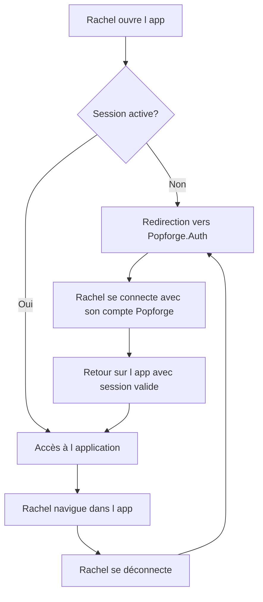

# Story 0.0 — Intégration OIDC et déploiement initial

**Statut :** `done`

En tant que Rachel, je veux pouvoir me connecter à mon application de comptabilité avec mon compte Popforge existant et être assurée qu'aucune donnée n'est accessible sans session valide, afin d'avoir un accès sécurisé dès la première utilisation.

---
## Dépendances

**Prérequis :** Aucun — cette story est la fondation du cluster `my-accounting`. Le client OIDC `my-accounting-cluster` est déjà enregistré dans Popforge.Auth. Aucune modification côté Auth.

**Stories qui dépendent de celle-ci :**
- Story 1.0 — Classement iCloud et recherche multi-critères
- Story 1.1 — Import des documents existants iCloud
- Story 1.2 — Capture mobile et stockage iCloud

---
## Diagramme de flux (Mermaid)

> Le diagramme représente les actions de Rachel et non les échanges techniques entre composantes.

## Critères d'acceptation (AC)

1. **AC1 — Redirection automatique vers la connexion** : Lorsque Rachel tente d'ouvrir n'importe quelle page de l'application sans session active, elle est automatiquement redirigée vers la page de connexion Popforge.Auth et aucun contenu de l'application n'est affiché.
   *Type de test : E2E Gherkin*

2. **AC2 — Connexion avec son compte Popforge** : Rachel se connecte avec son identifiant et mot de passe Popforge, elle est redirigée vers l'application et peut naviguer normalement.
   *Type de test : Manuel*

3. **AC3 — API protégée côté serveur** : Toute requête adressée à l'API sans jeton d'accès valide reçoit une réponse 401 et aucune donnée n'est retournée, indépendamment de l'état du frontend.
   *Type de test : Unit (xUnit)*

4. **AC4 — Déconnexion** : Lorsque Rachel se déconnecte, sa session est révoquée et elle est redirigée vers la page de connexion. Elle ne peut plus accéder aux pages protégées sans se reconnecter.
   *Type de test : Manuel*

### Scénarios Gherkin

> Exemption partielle — la connexion et la déconnexion réelles (AC2, AC4) nécessitent un flux OIDC complet avec Popforge.Auth et sont validées manuellement.
> AC1 (redirection sans session) et AC3 (protection API) sont couverts respectivement en E2E Gherkin et xUnit.

Voir : `src/my-accounting/tests/e2e/features/authentification-oidc.feature`

---
## Design UI / UX

**Approche :** Mobile-first — l'écran de connexion est fourni par Popforge.Auth (hors périmètre de cette story). L'application affiche uniquement les états de transition.

### États et messages UI

| État | Ce que Rachel voit |
|---|---|
| Non authentifiée, accès à une route protégée | Écran blanc ou spinner bref, puis redirection transparente vers Popforge.Auth |
| Retour après connexion réussie | Accueil de l'application sans message de confirmation — la navigation est disponible |
| Après déconnexion | Redirection vers Popforge.Auth — même expérience que le premier accès |
| Erreur de connexion (token invalide côté API) | Message : « Votre session a expiré. Veuillez vous reconnecter. » + bouton « Se reconnecter » |

> Aucune maquette d'écran propre à cette story : l'UI de connexion appartient à Popforge.Auth. Les transitions sont transparentes pour Rachel.

---
## API — Endpoints

**Cluster :** `my-accounting` | **Microservice :** `MyAccounting.Server`

Tous les endpoints existants et futurs sont protégés via `[Authorize]` avec le schéma `OpenIddictValidationAspNetCore`. Aucun endpoint public n'est exposé dans ce cluster (hormis health check si applicable).

**Erreurs communes à tous les endpoints protégés :**

| HTTP | errorCode | Message utilisateur affiché |
|---|---|---|
| 401 | `UserNotAuthenticated` | Votre session a expiré. Veuillez vous reconnecter. |

---
## Schéma de base de données

Aucune table créée par cette story — la gestion des sessions et tokens est entièrement déléguée à Popforge.Auth.

---
## Déploiement

**Cluster :** `my-accounting` | **Environnements :** Dev local → Beta → Production

### Variables d'environnement et secrets

| Variable | Scope | Valeur dev | Valeur prod |
|---|---|---|---|
| `VITE_OIDC_AUTHORITY` | Frontend (Vite) | `https://auth-beta.popsalon.app` | `https://auth.popsalon.app` |
| `VITE_OIDC_CLIENT_ID` | Frontend (Vite) | `my-accounting-cluster` | `my-accounting-cluster` |
| `Oidc__Authority` | Backend (Docker env) | `https://auth-beta.popsalon.app` | `https://auth.popsalon.app` |
| `NPM_TOKEN` | CI GitHub + local | PAT GitHub `read:packages` | Idem |

### Fichiers `.env` à créer

- `src/my-accounting/app/.env.development`
- `src/my-accounting/app/.env.production`

### Configuration nginx / Docker

- Ajouter `Oidc__Authority` dans `docker-compose.deploy.yml` pour le service `my-accounting-server`.
- Aucune règle nginx supplémentaire requise : le callback OIDC (`/auth/callback`) est une route Vue Router, pas un endpoint serveur.

### Référence complète d'implantation

Voir : [docs/architecture/oidc-integration.md](../../../architecture/oidc-integration.md) — toutes les instructions de code sont déjà spécifiques au cluster `my-accounting`.

---
## Tâches de développement

### Frontend (Vue 3 + TypeScript) — `src/my-accounting/app/`

- [ ] Créer `.npmrc` avec `@popforge:registry=https://npm.pkg.github.com`
- [ ] Installer `@popforge/cluster-core`
- [ ] Appeler `createOidcManager()` dans `src/main.ts`
- [ ] Ajouter la route `/auth/callback` avec le composant `AuthCallback` dans le router
- [ ] Ajouter le guard `router.beforeEach` — toutes les routes avec `meta: { requiresAuth: true }`
- [ ] Créer `.env.development` et `.env.production` avec `VITE_OIDC_AUTHORITY` et `VITE_OIDC_CLIENT_ID`
- [ ] Remplacer les appels `fetch` par `authFetch` de `@popforge/cluster-core`

### Backend (.NET 10) — `src/my-accounting/server/MyAccounting.Server/`

- [ ] Ajouter les packages NuGet `OpenIddict.AspNetCore`, `OpenIddict.Client.SystemNetHttp` et `Swashbuckle.AspNetCore`
- [ ] Configurer `AddOpenIddict().AddValidation(...)` dans `Program.cs`
- [ ] Ajouter `UseAuthentication()` et `UseAuthorization()` dans le pipeline
- [ ] Exposer Swagger UI à `/swagger/index.html` (conforme à la topologie — voir `docs/architecture/saas-cluster-topology.md`)
- [ ] Créer `appsettings.json` et `appsettings.Development.json` avec `Oidc:Authority`
- [ ] Décorer les controllers avec `[Authorize(AuthenticationSchemes = OpenIddictValidationAspNetCoreDefaults.AuthenticationScheme)]`
- [ ] Ajouter `Oidc__Authority` dans `docker-compose.deploy.yml`
- [ ] Créer les tests d'intégration `AuthorizationTests` — valider que les endpoints retournent 401 sans token

### Tests E2E

- [ ] Créer `authentification-oidc.feature` — scénario de redirection sans session active
- [ ] Créer les step definitions `authentification.steps.ts`

---
## Artefacts techniques

| Type | Chemin | Action |
|------|--------|--------|
| Config npm | `src/my-accounting/app/.npmrc` | Créer |
| Package OIDC | `@popforge/cluster-core` | Installer |
| Point d'entrée Vue | `src/my-accounting/app/src/main.ts` | Modifier |
| Router Vue | `src/my-accounting/app/src/router/index.ts` | Modifier |
| Env dev | `src/my-accounting/app/.env.development` | Créer |
| Env prod | `src/my-accounting/app/.env.production` | Créer |
| Program.cs | `src/my-accounting/server/MyAccounting.Server/Program.cs` | Modifier |
| appsettings | `src/my-accounting/server/MyAccounting.Server/appsettings.json` | Modifier |
| appsettings dev | `src/my-accounting/server/MyAccounting.Server/appsettings.Development.json` | Modifier |
| Docker compose | `docker-compose.deploy.yml` | Modifier |
| Feature Gherkin | `src/my-accounting/tests/e2e/features/authentification-oidc.feature` | Créer |
| Step definitions | `src/my-accounting/tests/e2e/steps/authentification.steps.ts` | Créer |
| Tests intégration | `src/my-accounting/tests/integration/Api/AuthorizationTests.cs` | Créer |

---
## Review Findings — Code Review 2026-04-26

### Patches appliqués ✅

- [x] [Patch] `UseHttpsRedirection()` removed (HTTP-only in Docker, nginx handles TLS) [`Program.cs:35`]
- [x] [Patch] CORS configuration added (`AddCors()` + `UseCors()` + `appsettings`) [`Program.cs`, `appsettings.json/Development.json`]
- [x] [Patch] Package `@popforge/cluster-core` version corrected (`^0.0.0` → `*`) [`package.json`]
- [x] [Patch] `docker-compose.deploy.yml` OIDC_Authority uses `:?` (fail-safe, not default) [`docker-compose.deploy.yml`]
- [x] [Patch] `Microsoft.AspNetCore.Mvc.Testing` added for integration tests [`MyAccounting.Tests.csproj`]
- [x] [Patch] `AuthorizationTests.cs` created — validates 401 on protected endpoint without token [`integration/Api/`]
- [x] [Patch] `OpenIddict.Client.SystemNetHttp` removed (unused for validation-only server) [`MyAccounting.Server.csproj`]

### Deferred findings

- [x] [Defer] `DocumentsController` kept as skeleton for Story 1.0 (pre-existing code not in scope)
- [x] [Defer] `authentification.steps.ts` — E2E steps deferred pending fixture auth-session (depends on GitHub Actions secrets and TEA strategy approval)

### Decision-needed items resolved

*None after Murat (TEA) approved E2E OIDC strategy.*

---
## E2E Strategy Approved by Murat (TEA) — 2026-04-26

**Decision**: All E2E Playwright tests with OIDC flows **MUST** run against beta deployed environment. No mocking of auth.

**Why**: Mocking local hides OIDC/CORS/token bugs that escape to production. Beta = realistic test.

**Implementation Plan** (Phase 2, after patches #1-7):
1. Create fixture `auth-session.ts` (fetches token from Popforge.Auth beta)
2. Configure GitHub Actions secrets (`TEST_USER_EMAIL`, `TEST_USER_PASSWORD`, `OIDC_CLIENT_SECRET`)
3. Implement step definitions with network-first pattern
4. Validate beta deployment (CORS, OIDC, Swagger)
5. Create CI/CD workflow for E2E beta

**See**: [`docs/test/e2e-oidc-strategy-approved.md`](../../../test/e2e-oidc-strategy-approved.md)

---
## Artefacts techniques

| Type | Chemin | Action |
|------|--------|--------|
| Config npm | `src/my-accounting/app/.npmrc` | Créer |
| Package OIDC | `@popforge/cluster-core` | Installer |
| Point d'entrée Vue | `src/my-accounting/app/src/main.ts` | Modifier |
| Router Vue | `src/my-accounting/app/src/router/index.ts` | Modifier |
| Env dev | `src/my-accounting/app/.env.development` | Créer |
| Env prod | `src/my-accounting/app/.env.production` | Créer |
| Program.cs | `src/my-accounting/server/MyAccounting.Server/Program.cs` | Modifier |
| appsettings | `src/my-accounting/server/MyAccounting.Server/appsettings.json` | Modifier |
| appsettings dev | `src/my-accounting/server/MyAccounting.Server/appsettings.Development.json` | Modifier |
| Docker compose | `docker-compose.deploy.yml` | Modifier |
| Feature Gherkin | `src/my-accounting/tests/e2e/features/authentification-oidc.feature` | Créer |
| Step definitions | `src/my-accounting/tests/e2e/steps/authentification.steps.ts` | Créer |
| Tests intégration | `src/my-accounting/tests/integration/Api/AuthorizationTests.cs` | Créer |

---
## Données de sortie / Cas d'erreur

| HTTP | errorCode | Message utilisateur affiché |
|---|---|---|
| 401 | `UserNotAuthenticated` | Votre session a expiré. Veuillez vous reconnecter. |

---
## Validation manuelle — Recette (à remplir post-déploiement)

> À compléter par Rachel sur l'environnement déployé (beta/prod) avant de marquer la story `Done`.

**Date de recette :** _______________
**Validée par :** _______________
**Environnement testé :** ☐ Beta  ☐ Production

### Scénarios vérifiés manuellement

| # | Scénario | Résultat | Notes |
|---|---|---|---|
| 1 | Ouvrir l'app sans session — redirection vers Popforge.Auth | ☐ Passe  ☐ Échoue | |
| 2 | Se connecter avec le compte Rachel — accès à l'app | ☐ Passe  ☐ Échoue | |
| 3 | Se déconnecter — redirection vers page de connexion | ☐ Passe  ☐ Échoue | |
| 4 | Appel API direct sans token (ex : curl) — réponse 401 | ☐ Passe  ☐ Échoue | |

### Résultat global

- ☐ **Approuvée** — tous les scénarios passent, story marquée `Done`
- ☐ **Rejetée** — voir notes ci-dessous, retour en développement

**Notes / Anomalies observées :**
>

---
## Sources

- [docs/architecture/oidc-integration.md](../../../architecture/oidc-integration.md)
- [docs/architecture/saas-cluster-topology.md](../../../architecture/saas-cluster-topology.md) — conventions URL, structure `/api/*` et `/swagger/index.html` obligatoires

