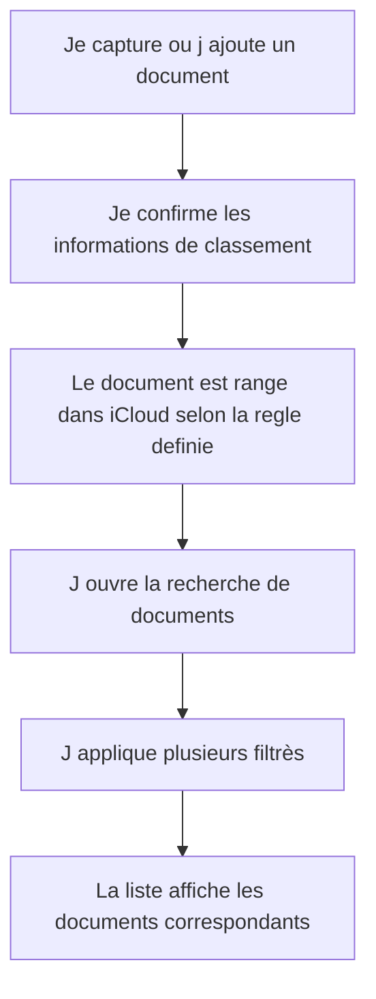

# Story 1.0 - Classement iCloud et recherche multi-critères

**Statut :** `ready-for-dev`

En tant que Rachel, je veux que chaque document capture soit classe automatiquement dans iCloud selon des regles claires et retrouvable avec des filtrès combines afin de retrouver mes pieces en quelques secondes sans fouiller manuellement.

---
## Dépendances

**Prérequis :** Story 0.0 — Intégration OIDC et déploiement initial (l'authentification doit être opérationnelle avant de développer les fonctionnalités métier)

**Stories qui dépendent de celle-ci :**
- Story 1.1 — Import des documents existants iCloud (utilise `documentClassificationRules` et la table `documents`)
- Story 1.2 — Capture mobile (utilise la table `documents` et les services de classement)

---
## Diagramme de flux (Mermaid)


> Le diagramme de flux représente les actions de Rachel et les Résultats visibles dans l'application.

## Critères d'acceptation (AC)

1. **AC1 — Classement iCloud standardise** : Lorsqu'un document est enregistre, Rachel voit un classement cohérent base sur l'année, le fournisseur, le type de paiement, le montant et la classification de depense déductible, avec une organisation stable d'un document a l'autre.
   *Type de test : E2E Gherkin*

2. **AC2 — Recherche multi-critères combinee** : Rachel peut filtrer ses documents avec un ou plusieurs critères en même temps et obtenir une liste pertinente sans etapes inutiles.
   *Type de test : E2E Gherkin*

3. **AC3 — Résultats clairs et exploitables** : Les Résultats de recherche affichent les informations de classement utiles a la vérification, afin que Rachel comprenne rapidement pourquoi un document apparaît dans les Résultats.
   *Type de test : E2E Gherkin*

4. **AC4 — Modification de classement** : Si une information de classement est corrigee, Rachel voit le document mis a jour dans sa nouvelle categorie et peut le retrouver avec les nouveaux filtrès.
   *Type de test : E2E Gherkin*

### Scénarios Gherkin

> Les Scénarios Gherkin sont la source de vérité et vivent dans le fichier `.feature` correspondant.
> Ne pas les dupliquer ici - pointer vers le fichier.

Voir : `src/my-accounting/tests/e2e/features/document-classement-icloud-recherche.feature`

---
## Design UI / UX

**Approche :** Mobile-first conformément à `docs/product/UX-UI/ux-ui-standards.md` — fonctionnel dès 375 px, ajustements desktop via `@media (min-width: 960px)`.

### `DocumentSearchPage.vue` — Écran de recherche avec filtres

**Mobile (375 px) :**
- En-tête avec titre « Mes documents »
- Panneau de filtres pliable/dépliable (icône entonnoir) contenant :
  - `<select>` Année (vide = toutes)
  - `<input text>` Fournisseur (recherche partielle)
  - `<select>` Type de dépense : Débit / Crédit / Argent comptant / Tous
  - `<input number>` Montant min — Montant max (sur une ligne, séparateur « à »)
  - `<select>` Catégorie de dépense (vide = toutes)
  - Bouton « Rechercher » (gradient `--grad-btn`)
- Liste de résultats : cards avec `nomFichier`, `fournisseur`, `annee`, `categorieDepense`, `montant`
- Clic sur une card → navigation vers `DocumentDetailPage`

**Desktop (≥ 960 px) :**
- Filtres affichés en ligne horizontale (non pliables)
- Liste de résultats en tableau

**États et messages UI :**

| État | Message affiché |
|---|---|
| Aucun résultat (200, liste vide) | « Aucun document ne correspond à vos filtres. » |
| Critères invalides (400) | « Un ou plusieurs critères de recherche sont invalides. » |
| Non authentifiée (401) | « Votre session a expiré. Veuillez vous reconnecter. » + bouton « Se reconnecter » |
| Chargement | Skeleton loader sur les cards |

---

### `DocumentDetailPage.vue` — Fiche document avec reclassement

**Mobile (375 px) :**
- En-tête avec titre « Fiche document » et bouton retour « ← Recherche »
- Section lecture seule : `nomFichier`, `cheminIcloud`, `dateDocument`, `dateIndexation`
- Section classement (formulaire inline) :
  - `<input text>` Fournisseur
  - `<select>` Type de dépense
  - `<input number>` Montant
  - `<select>` Catégorie de dépense
  - Bouton « Enregistrer le classement » (gradient `--grad-btn`)

**Desktop (≥ 960 px) :**
- Mise en page deux colonnes : lecture seule à gauche, formulaire de classement à droite

**États et messages UI :**

| État | Message affiché |
|---|---|
| Sauvegarde réussie | Toast « Classement mis à jour. » |
| Validation échouée (400) | Message inline sous le champ concerné |
| Document introuvable (404) | « Ce document est introuvable. » + bouton « Retour à la recherche » |
| Non authentifiée (401) | « Votre session a expiré. Veuillez vous reconnecter. » |

---
## API — Endpoints

**Cluster :** `my-accounting` | **Microservice :** `MyAccounting.Server`

### GET `/api/documents`

Recherche de documents par critères de classement.

**Query parameters (tous optionnels, combinables) :**

| Paramètre | Type | Exemple | Description |
|---|---|---|---|
| `annee` | `int` | `2026` | Année du document |
| `fournisseur` | `string` | `EDF` | Nom du fournisseur (recherche partielle insensible à la casse) |
| `typeDepense` | `string` | `debit` | Type de paiement : `debit`, `credit`, `argent_comptant` |
| `montantMin` | `decimal` | `0` | Montant minimum inclus |
| `montantMax` | `decimal` | `100` | Montant maximum inclus |
| `categorieDepense` | `string` | `energie` | Classification de dépense déductible |

**Réponse 200 :**
```json
{
   "documents": [
      {
         "id": "uuid",
         "nomFichier": "2026-01-15_EDF_facture energie_45.00.pdf",
         "annee": 2026,
         "fournisseur": "EDF",
         "typeDepense": "debit",
         "montant": 45.00,
         "categorieDepense": "energie",
         "dateDocument": "2026-01-15",
         "cheminIcloud": "iCloud Drive/Documents/Classeur/Finance/2026/!Facturette/..."
      }
   ],
   "total": 1
}
```

**Erreurs :** `400 InvalidSearchCriteria`, `401 UserNotAuthenticated`

---

### GET `/api/documents/{id}`

Fiche complète d'un document.

**Réponse 200 :** même structure qu'un élément du tableau ci-dessus.
**Erreurs :** `401 UserNotAuthenticated`, `404 DocumentNotFound`

---

### PATCH `/api/documents/{id}/classement`

Modification du classement d'un document existant.

**Corps :**
```json
{
   "fournisseur": "EDF Gaz",
   "categorieDepense": "chauffage",
   "typeDepense": "debit",
   "montant": 45.00
}
```

**Réponse 200 :** document mis à jour.
**Erreurs :** `400 DocumentValidationFailed`, `401 UserNotAuthenticated`, `404 DocumentNotFound`

---
## Schéma de base de données

**Base :** Neon PostgreSQL | **Cluster :** `my-accounting`

### Table `documents`

```sql
CREATE TABLE documents (
      id              UUID PRIMARY KEY DEFAULT gen_random_uuid(),
      nom_fichier     TEXT NOT NULL,
      chemin_icloud   TEXT NOT NULL,
      annee           INTEGER NOT NULL,
      fournisseur     TEXT NOT NULL,
      type_depense    TEXT NOT NULL CHECK (type_depense IN ('debit', 'credit', 'argent_comptant')),
      montant         NUMERIC(10, 2) NOT NULL,
      categorie_depense TEXT NOT NULL,
      date_document   DATE,
      date_indexation TIMESTAMPTZ NOT NULL DEFAULT now(),
      checksum        TEXT NOT NULL,
      CONSTRAINT uq_document_icloud UNIQUE (chemin_icloud, checksum)
);

CREATE INDEX idx_documents_annee     ON documents (annee);
CREATE INDEX idx_documents_fournisseur ON documents (LOWER(fournisseur));
CREATE INDEX idx_documents_categorie  ON documents (categorie_depense);
CREATE INDEX idx_documents_recherche  ON documents (annee, type_depense, categorie_depense);
```

**Notes :**
- La contrainte `UNIQUE (chemin_icloud, checksum)` prévient les doublons lors d'imports rejoués (R-001 du plan de test).
- La migration EF Core sera créée par le dev agent dans `MyAccounting.Server/Migrations/`.

---
## Déploiement

**Cluster :** `my-accounting` | **Environnements :** Preview → Staging → Production

### Variables d'environnement et secrets

> Aucun nouveau secret n'est introduit par cette story. La connexion à Neon PostgreSQL utilise la variable déjà provisionnée pour le cluster `my-accounting`.

| Variable | Scope | Remarque |
|---|---|---|
| `ConnectionStrings__Default` | Serveur | Chaîne Neon PostgreSQL existante — aucune modification requise |

### Migration base de données

- La migration EF Core `InitialCreate` (table `documents` + index) est appliquée automatiquement au démarrage du conteneur via `context.Database.MigrateAsync()`.
- En cas de rollback : supprimer la migration et restaurer depuis le snapshot Neon.

### Configuration nginx / Docker

> Aucune modification nginx ou Docker requise : le cluster `my-accounting` est déjà routé et conteneurisé. Le `Dockerfile` existant dans `src/my-accounting/server/MyAccounting.Server/` est réutilisé sans changement.

### Monitoring / Alerting

> Pas de nouveau monitoring spécifique à cette story. Les logs applicatifs .NET (stdout → journald) et les métriques Neon existantes couvrent cette fonctionnalité.

---
## Tâches de développement

### Backend (.NET 10)
- [ ] Créer l'entité `Document` et le `DbContext` EF Core
- [ ] Créer la migration initiale (`InitialCreate`) incluant la table `documents` et ses index
- [ ] Créer `DocumentClassificationService` avec validation des 5 critères
- [ ] Créer `DocumentRepository` avec méthode de recherche multi-critères
- [ ] Créer `DocumentsController` avec endpoints `GET /api/documents`, `GET /api/documents/{id}`, `PATCH /api/documents/{id}/classement`
- [ ] Créer les tests unitaires : `DocumentClassificationServiceTests` avec `[Trait("Epic","1")][Trait("Story","1-0")]`
- [ ] Créer les tests d'intégration : `DocumentsControllerTests` et `DocumentRepositoryTests`

### Frontend (Vue 3 + TypeScript)
- [ ] Créer `documentClassificationRules.ts` — constantes des critères (types de paiement, catégories de dépense)
- [ ] Créer `documentSearchService.ts` — appels API `GET /api/documents`
- [ ] Créer `useDocumentStore.ts` (Pinia) — état de la liste et des filtres actifs
- [ ] Créer `DocumentSearchPage.vue` — interface de recherche avec filtres combinables
- [ ] Créer `DocumentDetailPage.vue` — fiche document avec formulaire de reclassement

### Tests E2E
- [ ] Créer `document-classement-icloud-recherche.feature` avec les 4 scénarios Gherkin
- [ ] Créer les step definitions `document-search.steps.ts`
- [ ] Créer `DocumentSearchPage.ts` (Page Object)

---

## Artefacts techniques

| Type | Chemin | Action |
|------|--------|--------|
| Feature Gherkin | `src/my-accounting/tests/e2e/features/document-classement-icloud-recherche.feature` | Creer |
| Regles de classement | `src/my-accounting/app/src/documents/services/documentClassificationRules.ts` | Creer |
| Service de recherche | `src/my-accounting/app/src/documents/services/documentSearchService.ts` | Creer |
| Ecran filtrès | `src/my-accounting/app/src/documents/DocumentSearchPage.vue` | Modifier |
| Fiche document | `src/my-accounting/app/src/documents/DocumentDetailPage.vue` | Creer |

---

## Données de sortie / Cas d'erreur

| HTTP | errorCode | Message utilisateur affiche |
|------|-----------|---------------------------|
| 200 | — | Documents trouves selon vos filtrès |
| 400 | `InvalidSearchCriteria` | Un ou plusieurs critères de recherche sont invalides |
| 401 | `UserNotAuthenticated` | Vous devez vous reconnecter pour acceder aux documents |
| 404 | `DocumentNotFound` | Le document demande est introuvable |

---

## Validation manuelle - Recette (à remplir post-déploiement)

> À compléter par Rachel sur l'environnement deploye (preview/staging/prod) avant de marquer la story `Done`.

**Date de recette :** _______________  
**ValIdée par :** _______________  
**Environnement testé :** ☐ Preview  ☐ Staging  ☐ Production  

### Scénarios vérifiés manuellement

| # | scénario | Résultat | Notes |
|---|---|---|---|
| 1 | AC1 - Classement iCloud standardise | ☐ Passe  ☐ Echoue | |
| 2 | AC2 - Recherche multi-critères combinee | ☐ Passe  ☐ Echoue | |
| 3 | AC4 - Reclassement apres correction d un document | ☐ Passe  ☐ Echoue | |

### Résultat global

- ☐ **Approuvée** - tous les Scénarios passent, story marquée `Done`
- ☐ **Rejetée** - voir notes ci-dessous, retour en développement

**Notes / Anomalies observées :**
> 

---


