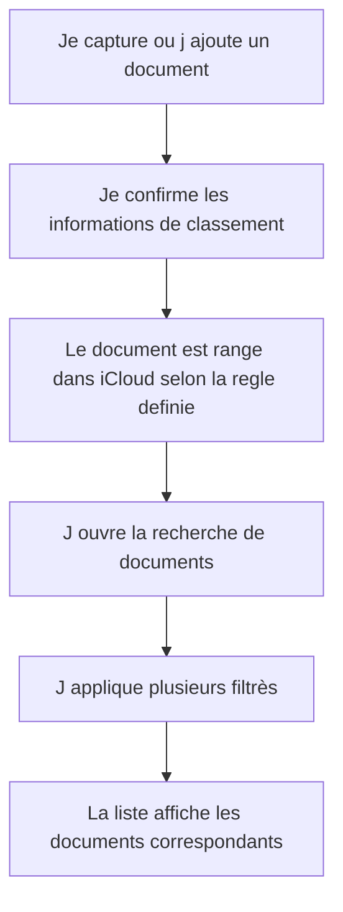

# Story 1.1 - Classement iCloud et recherche multi-critères

**Statut :** `backlog`

En tant que Rachel, je veux que chaque document capture soit classe automatiquement dans iCloud selon des regles claires et retrouvable avec des filtrès combines afin de retrouver mes pieces en quelques secondes sans fouiller manuellement.

---
## Diagramme de flux (Mermaid)

> Le diagramme de flux représente les actions de Rachel et les Résultats visibles dans l'application.

## Critères d'acceptation (AC)

1. **AC1 — Classement iCloud standardise** : Lorsqu'un document est enregistre, Rachel voit un classement cohérent base sur l'année, le fournisseur, le type de paiement, le montant et la classification de depense déductible, avec une organisation stable d'un document a l'autre.
   *Type de test : E2E Gherkin*

2. **AC2 — Recherche multi-critères combinee** : Rachel peut filtrer ses documents avec un ou plusieurs critères en même temps et obtenir une liste pertinente sans etapes inutiles.
   *Type de test : E2E Gherkin*

3. **AC3 — Résultats clairs et exploitables** : Les Résultats de recherche affichent les informations de classement utiles a la vérification, afin que Rachel comprenne rapidement pourquoi un document apparaît dans les Résultats.
   *Type de test : E2E Gherkin*

4. **AC4 — Modification de classement** : Si une information de classement est corrigee, Rachel voit le document mis a jour dans sa nouvelle categorie et peut le retrouver avec les nouveaux filtrès.
   *Type de test : E2E Gherkin*

### Scénarios Gherkin

> Les Scénarios Gherkin sont la source de vérité et vivent dans le fichier `.feature` correspondant.
> Ne pas les dupliquer ici - pointer vers le fichier.

Voir : `src/accounting/tests/e2e/features/document-classement-icloud-recherche.feature`

---

## Artefacts techniques

| Type | Chemin | Action |
|------|--------|--------|
| Feature Gherkin | `src/accounting/tests/e2e/features/document-classement-icloud-recherche.feature` | Creer |
| Regles de classement | `src/accounting/client/mobile/documents/services/documentClassificationRules.ts` | Creer |
| Service de recherche | `src/accounting/client/mobile/documents/services/documentSearchService.ts` | Creer |
| Ecran filtrès | `src/accounting/client/mobile/documents/DocumentSearchPage.vue` | Modifier |
| Fiche document | `src/accounting/client/mobile/documents/DocumentDetailPage.vue` | Creer |

---

## Données de sortie / Cas d'erreur

| HTTP | errorCode | Message utilisateur affiche |
|------|-----------|---------------------------|
| 200 | — | Documents trouves selon vos filtrès |
| 400 | `InvalidSearchCriteria` | Un ou plusieurs critères de recherche sont invalides |
| 401 | `UserNotAuthenticated` | Vous devez vous reconnecter pour acceder aux documents |
| 404 | `DocumentNotFound` | Le document demande est introuvable |

---

## Validation manuelle - Recette (à remplir post-déploiement)

> À compléter par Rachel sur l'environnement deploye (preview/staging/prod) avant de marquer la story `Done`.

**Date de recette :** _______________  
**ValIdée par :** _______________  
**Environnement testé :** ☐ Preview  ☐ Staging  ☐ Production  

### Scénarios vérifiés manuellement

| # | scénario | Résultat | Notes |
|---|---|---|---|
| 1 | AC1 - Classement iCloud standardise | ☐ Passe  ☐ Echoue | |
| 2 | AC2 - Recherche multi-critères combinee | ☐ Passe  ☐ Echoue | |
| 3 | AC4 - Reclassement apres correction d un document | ☐ Passe  ☐ Echoue | |

### Résultat global

- ☐ **Approuvée** - tous les Scénarios passent, story marquée `Done`
- ☐ **Rejetée** - voir notes ci-dessous, retour en développement

**Notes / Anomalies observées :**
> 

---

