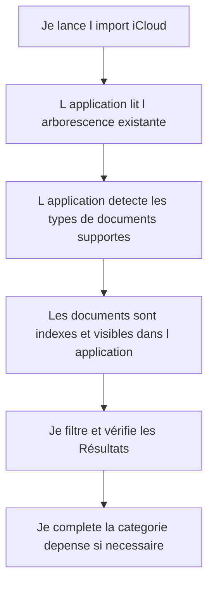

# Story 1.1 - Import des documents existants iCloud

**Statut :** `backlog`

**Dépend de :** [Story 1.0 - Classement iCloud et recherche multi-critères](./story-1-0-classement-icloud-et-recherche-multi-criteres.md) — le service `documentClassificationRules.ts` et le schéma d'index PostgreSQL doivent exister avant l'import.

En tant que Rachel, je veux que l application prenne en compte les documents déjà presents dans mon iCloud et les importe dans mon espace de travail afin de conserver mon historique sans recommencer tout le classement à zéro.

---
## Diagramme de flux (Mermaid)

> Le diagramme de flux représente les actions de Rachel et les Résultats visibles dans l application.

## Critères d'acceptation (AC)

1. **AC1 — Lecture de l arborescence iCloud existante** : Rachel peut lancer un import depuis la racine `iCloud Drive/Documents/Classeur/Finance/{année}/{TypeDeDocument}` et voir un Résultat qui confirme le nombre de documents trouves par année et par type de document.
   *Type de test : E2E Gherkin*

2. **AC2 — Support des deux types prioritaires** : L import prend en charge en priorite les dossiers `!Facturette` et `Releves - X`, afin de couvrir les facturettes de dépenses et les releves bancaires déjà classes.
   *Type de test : E2E Gherkin*

3. **AC3 — Prise en compte de la structure !Facturette** : Pour `!Facturette`, l application reconnait les sous dossiers existants comme `!Argent Comptant`, les dossiers fournisseurs comme `Bureau en gros`, le dossier `Virements interact`, et les documents sans sous dossier pour les pieces annuelles comme les taxes municipales.
   *Type de test : E2E Gherkin*

4. **AC4 — Interpretation du nommage existant** : L import interprete le format de nom actuel `{Date}_{Fournisseur}_{description}_{Montant}` par exemple `2026-02-15_Nessrin Elhadary_pers Rachel_39,40$.pdf`, puis affiche les informations extraites dans la fiche du document.
   *Type de test : E2E Gherkin*

5. **AC5 — évolution vers le nommage cible** : Rachel peut renseigner ou corriger la categorie de depense pour tendre vers le format cible `{Date}_{Fournisseur}_{categorie depense}_{description}_{Montant}` sans perdre l historique déjà importe.
   *Type de test : E2E Gherkin*

6. **AC6 — Import non destructif** : L import conserve les documents sources existants dans iCloud et n exige pas de deplacement manuel avant utilisation de l application.
   *Type de test : Manuel*

### Scénarios Gherkin

> Les Scénarios Gherkin sont la source de vérité et vivent dans le fichier `.feature` correspondant.
> Ne pas les dupliquer ici - pointer vers le fichier.

Voir : `src/my-accounting/tests/e2e/features/document-import-icloud-existant.feature`

---

## Artefacts techniques

| Type | Chemin | Action |
|------|--------|--------|
| Feature Gherkin | `src/my-accounting/tests/e2e/features/document-import-icloud-existant.feature` | Creer |
| Service import iCloud | `src/my-accounting/app/src/documents/services/iCloudImportService.ts` | Creer |
| Parseur nom de fichier | `src/my-accounting/app/src/documents/services/documentFilenameParser.ts` | Creer |
| Ecran import iCloud | `src/my-accounting/app/src/documents/DocumentImportICloudPage.vue` | Creer |
| Store documents | `src/my-accounting/app/src/documents/stores/useDocumentStore.ts` | Modifier |

---

## Données de sortie / Cas d'erreur

| HTTP | errorCode | Message utilisateur affiche |
|------|-----------|---------------------------|
| 200 | — | Import termine, vos documents iCloud sont disponibles |
| 400 | `InvalidImportRootPath` | Le chemin iCloud configure est invalide |
| 401 | `UserNotAuthenticated` | Vous devez vous reconnecter pour lancer un import |
| 404 | `ImportSourceNotFound` | Le dossier source iCloud est introuvable |

---

## Validation manuelle - Recette (à remplir post-déploiement)

> À compléter par Rachel sur l environnement deploye (preview/staging/prod) avant de marquer la story `Done`.

**Date de recette :** _______________  
**ValIdée par :** _______________  
**Environnement testé :** ☐ Preview  ☐ Staging  ☐ Production  

### Scénarios vérifiés manuellement

| # | scénario | Résultat | Notes |
|---|---|---|---|
| 1 | AC1 - Lecture de l arborescence iCloud existante | ☐ Passe  ☐ Echoue | |
| 2 | AC3 - Reconnaissance des sous dossiers !Facturette | ☐ Passe  ☐ Echoue | |
| 3 | AC6 - Import non destructif des documents sources | ☐ Passe  ☐ Echoue | |

### Résultat global

- ☐ **Approuvée** - tous les Scénarios passent, story marquée `Done`
- ☐ **Rejetée** - voir notes ci dessous, retour en développement

**Notes / Anomalies observées :**
> 

---

