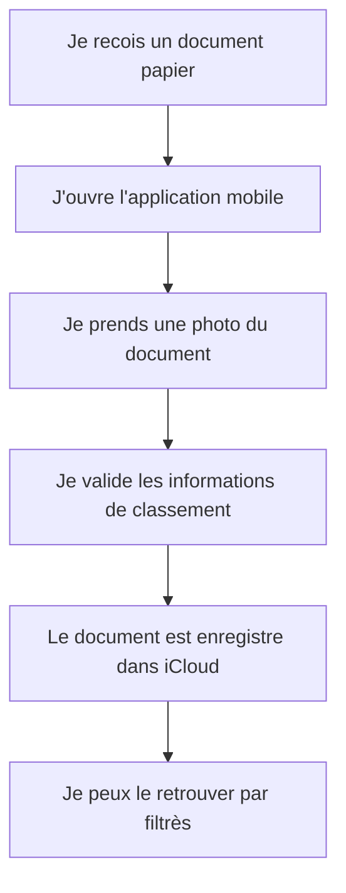

# Story 1.2 - Capture mobile et stockage iCloud rapide

**Statut :** `backlog`

**Dépend de :** [Story 1.0 - Classement iCloud et recherche multi-critères](./story-1-0-classement-icloud-et-recherche-multi-criteres.md) — le schéma de classement et l'index PostgreSQL doivent exister avant la capture.

En tant que Rachel, je veux photographier un document depuis l'application mobile et le stocker en quelques operations dans iCloud afin de ne pas accumuler de papier et de retrouver facilement mes pieces plus tard.

---
## Diagramme de flux (Mermaid)

> Le diagramme de flux représente les actions de Rachel et les Résultats visibles dans l'application.

## Critères d'acceptation (AC)

1. **AC1 — Capture mobile en quelques operations** : Depuis son telephone, Rachel peut photographier un document et le sauvegarder en quelques operations simples, sans sequence longue ni manipulation complexe, avec une confirmation visible de succes.
   *Type de test : E2E Gherkin*

2. **AC2 — Stockage iCloud fiable** : Une fois la capture valIdée, le document est stocke dans iCloud et reste accessible apres fermeture puis reouverture de l'application.
   *Type de test : E2E Gherkin*

3. **AC3 — Classement obligatoire a l'enregistrement** : Lors de l'enregistrement, Rachel peut renseigner ou confirmer les informations de classement année, fournisseur, type de paiement, montant et classification de depense déductible, puis les voir affichees sur la fiche du document.
   *Type de test : E2E Gherkin*

4. **AC4 — Retrouvabilite par filtrès** : Rachel peut retrouver un document en utilisant un ou plusieurs filtrès de classement sans parcourir toute la liste des documents manuellement.
   *Type de test : E2E Gherkin*

### Scénarios Gherkin

> Les Scénarios Gherkin sont la source de vérité et vivent dans le fichier `.feature` correspondant.
> Ne pas les dupliquer ici - pointer vers le fichier.

Voir : `src/my-accounting/tests/e2e/features/document-capture-mobile-icloud.feature`

---

## Artefacts techniques

| Type | Chemin | Action |
|------|--------|--------|
| Feature Gherkin | `src/my-accounting/tests/e2e/features/document-capture-mobile-icloud.feature` | Creer |
| Ecran mobile | `src/my-accounting/app/src/capture/DocumentCapturePage.vue` | Creer |
| Formulaire classement | `src/my-accounting/app/src/capture/components/DocumentClassificationForm.vue` | Creer |
| Service iCloud | `src/my-accounting/app/src/capture/services/iCloudStorageService.ts` | Creer |
| Ecran recherche documents | `src/my-accounting/app/src/documents/DocumentSearchPage.vue` | Creer |

---

## Données de sortie / Cas d'erreur

| HTTP | errorCode | Message utilisateur affiche |
|------|-----------|---------------------------|
| 200 | — | Document enregistre avec succes dans iCloud |
| 400 | `DocumentValidationFailed` | Certaines informations du document sont manquantes ou invalides |
| 401 | `UserNotAuthenticated` | Vous devez vous reconnecter pour enregistrer un document |
| 404 | `ICloudFolderNotFound` | Le dossier iCloud de destination est introuvable |

---

## Validation manuelle - Recette (à remplir post-déploiement)

> À compléter par Rachel sur l'environnement deploye (preview/staging/prod) avant de marquer la story `Done`.

**Date de recette :** _______________  
**ValIdée par :** _______________  
**Environnement testé :** ☐ Preview  ☐ Staging  ☐ Production  

### Scénarios vérifiés manuellement

| # | scénario | Résultat | Notes |
|---|---|---|---|
| 1 | AC1 - Capture mobile en quelques operations | ☐ Passe  ☐ Echoue | |
| 2 | AC2 - Stockage iCloud fiable apres reouverture | ☐ Passe  ☐ Echoue | |
| 3 | AC4 - Retrouver un document avec filtrès combines | ☐ Passe  ☐ Echoue | |

### Résultat global

- ☐ **Approuvée** - tous les Scénarios passent, story marquée `Done`
- ☐ **Rejetée** - voir notes ci-dessous, retour en développement

**Notes / Anomalies observées :**
> 

---

