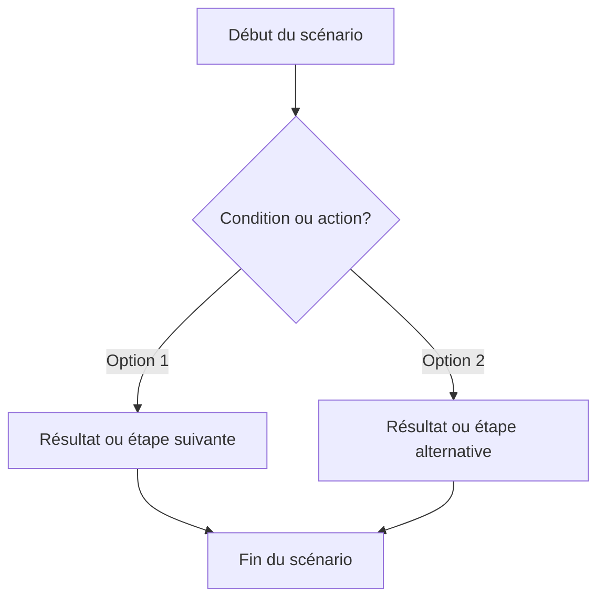

# Story X.Y — [Titre succinct]

**Statut :** `backlog`

En tant que [persona — voir docs/product/personas.md], je veux [action] afin de [bénéfice mesurable].

**Dépend de :** Story X.A, Story X.B *(supprimer si aucune)*

---

## Prérequis et dépendances

### Stories bloquantes

| Story | Description | Pourquoi requis |
|-------|-------------|-----------------|
| Story X.A | [Titre] | [Ce que cette story fournit et dont cette story a besoin] |

> S'il n'y a pas de story bloquante, écrire « Aucune ».

### Prérequis infrastructure cross-cluster
> Remplir uniquement si la story active ou utilise un canal inter-cluster (M2M, provisioning, etc.)

- [ ] Canal [Cluster A] → [Cluster B] validé opérationnel en beta
- [ ] Endpoint `[GET/POST /api/...]` existe et répond dans [Cluster cible] en beta
- [ ] Variables d'environnement cross-cluster configurées : `[VAR_NAME]` dans [Cluster]

> **Règle DOR** : si un canal cross-cluster est requis et non encore validé, créer une spike technique avant de démarrer cette story.

---
## Diagramme de flux (Mermaid)

> Ne pas utiliser les caractères `{` et `}` dans les diagramme Mermaid — ils ne sont pas supportés.
> Le diagramme de flux doit représenter les actions utilisateurs et non les échanges entre les composantes techniques.
> Les étapes du diagramme doivent correspondre aux critères d'acceptation et aux scénarios.

## Critères d'acceptation (AC)

1. **AC1 — [Titre court du critère]** : [Description du comportement attendu. Décrire le contexte, l'action de l'utilisateur et le résultat visible à l'écran.]  
   *Type de test : E2E Gherkin / Unit (xUnit) / Unit (Vitest) / Manuel*

2. **AC2 — [Titre court du critère]** : [Description...]  
   *Type de test : ...*

### Scénarios Gherkin

> Les scénarios Gherkin sont la source de vérité et vivent dans le fichier `.feature` correspondant.  
> Ne pas les dupliquer ici — pointer vers le fichier.

Voir : `src/{ClusterName}/tests/e2e/features/[feature-file].feature`

---

## UI-UX — Maquettes et prototypes

> créer une maquette ici proposée en ASCII pour chaque écran ou interaction clé, ou pointer vers un prototype Figma/html sous `docs/product/ui-ux/maquettes`.

---

## Artefacts techniques

| Type | Chemin | Action |
|------|--------|--------|
| Vue component | `src/{ClusterName}/client/...` | Créer / Modifier |
| API endpoint | `GET/POST /[route]` | Créer / Existant |
| Store Pinia | `src/{ClusterName}/client/...` | Créer / Modifier |
| Controller C# | `src/{ClusterName}/server/.../Controllers/...` | Créer / Modifier |

---

## Données de sortie / Cas d'erreur

| HTTP | errorCode | Message utilisateur affiché |
|------|-----------|---------------------------|
| 200 | — | Succès — [description du résultat visible] |
| 400 | `[ErrorCode]` | [Message vu par l'utilisateur] |
| 401 | `[ErrorCode]` | [Message vu par l'utilisateur] |
| 404 | `[ErrorCode]` | [Message vu par l'utilisateur] |

---

## Validation manuelle — Recette (à remplir post-déploiement)

> À compléter par Rachel sur l'environnement déployé (preview/staging/prod) avant de marquer la story `Done`.

**Date de recette :** _______________  
**Validée par :** _______________  
**Environnement testé :** ☐ Preview  ☐ Staging  ☐ Production  

### Scénarios vérifiés manuellement

| # | Scénario | Résultat | Notes |
|---|---|---|---|
| 1 | [AC1 — description courte — cas nominal] | ☐ Passe  ☐ Échoue | |
| 2 | [AC2 — description courte — cas nominal] | ☐ Passe  ☐ Échoue | |
| 3 | [Cas d'erreur principal — message affiché correct] | ☐ Passe  ☐ Échoue | |

### Résultat global

- ☐ **Approuvée** — tous les scénarios passent, story marquée `Done`
- ☐ **Rejetée** — voir notes ci-dessous, retour en développement

**Notes / Anomalies observées :**
> 

---

